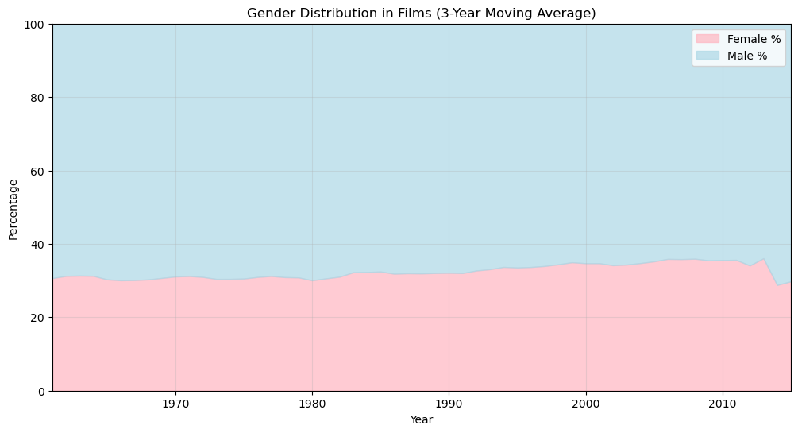

# 🎥 **Exploring Gender and Character Tropes in Film**  

---

## 🎯 **Objective**  
To begin this study, we investigate how character tropes in movies vary based on gender.

---

## 📊 **Gender Representation in Film**  

### **Gender Distribution**  

  <!-- Left: Text Content -->
  

    
<strong>📊 Overall Representation</strong>: Women account for only <strong>30%</strong> of all characters in movies, a figure that has remained largely stagnant over decades.

    
<strong>🎭 Trope Representation</strong>: In the dataset of trope-rich roles, only <strong>14%</strong> of characters are female, compared to <strong>86%</strong> male.

  

  <!-- Right: Image -->
  

    
  

  

🟢 **Observation**: 
There are 6 times more male occurence of these character tropes than female ones, which means that only 14% of the characters in this tropes dataset are women. This is half the count of women in films that we showed above which was already low. This shows that there are in addition to having a lot less female representation in movies, we also lack the data on which type of characters these actresses portray. The most common trope we see here for women are "dumb blonde" and "brainless beauty" which are very stereotypical tropes. However, it is important to note again that the dataset is not big enough and there is clearly not enough data for women archetypes.

| **Metric**                 | **Male** | **Female** |
|----------------------------|----------|------------|
| **Overall Representation** | 70%      | 30%        |
| **Trope Representation**   | 86%      | 14%        |

---

## 📝 **Lexical Analysis: Descriptive Words**  

Explanation

### **Word Count Per Character**  
| **Metric**            | **Male Characters** | **Female Characters** |
|------------------------|---------------------|------------------------|
| **Mean**              | 2.34 words         | 1.71 words            |
| **Median**            | 2                  | 2                     |
| **Maximum**           | 5 words            | 3 words               |

🔍 **Key Insight**:  
Male characters receive **37% more descriptive words on average** than female characters, reflecting deeper character development.  

### **Adjective Usage**  

<strong>🔵 Male Characters</strong>  
<table>
  <thead>
    <tr>
      <th>Adjective</th>
      <th>Frequency</th>
    </tr>
  </thead>
  <tbody>
    <tr>
      <td>None</td>
      <td>3189 (64.2%)</td>
    </tr>
    <tr>
      <td>Crazy, jealous</td>
      <td>398 (8.0%)</td>
    </tr>
    <tr>
      <td>Byronic</td>
      <td>290 (5.8%)</td>
    </tr>
    <tr>
      <td>Corrupt, corporate</td>
      <td>247 (5.0%)</td>
    </tr>
    <tr>
      <td>Dirty</td>
      <td>144 (2.9%)</td>
    </tr>
    <tr>
      <td>Cultured</td>
      <td>104 (2.1%)</td>
    </tr>
    <tr>
      <td>Fastest</td>
      <td>101 (2.0%)</td>
    </tr>
    <tr>
      <td>Loveable</td>
      <td>96 (1.9%)</td>
    </tr>
    <tr>
      <td>Sargeant</td>
      <td>93 (1.9%)</td>
    </tr>
    <tr>
      <td>Egomaniac</td>
      <td>91 (1.8%)</td>
    </tr>
    <tr>
      <td>Romantic</td>
      <td>72 (1.4%)</td>
    </tr>
    <tr>
      <td>Professional</td>
      <td>66 (1.3%)</td>
    </tr>
    <tr>
      <td>Young</td>
      <td>62 (1.2%)</td>
    </tr>
    <tr>
      <td>Arrogant</td>
      <td>58 (1.2%)</td>
    </tr>
    <tr>
      <td>Absent, minded</td>
      <td>56 (1.1%)</td>
    </tr>
    <tr>
      <td>Playful</td>
      <td>56 (1.1%)</td>
    </tr>
    <tr>
      <td>Evil</td>
      <td>53 (1.1%)</td>
    </tr>
    <tr>
      <td>Crazy</td>
      <td>51 (1.0%)</td>
    </tr>
    <tr>
      <td>Soft</td>
      <td>46 (0.9%)</td>
    </tr>
    <tr>
      <td>Eccentric</td>
      <td>46 (0.9%)</td>
    </tr>
    <tr>
      <td>Grumpy, old</td>
      <td>45 (0.9%)</td>
    </tr>
    <tr>
      <td>Stupid</td>
      <td>43 (0.9%)</td>
    </tr>
    <tr>
      <td>Big</td>
      <td>36 (0.7%)</td>
    </tr>
    <tr>
      <td>Dumb</td>
      <td>34 (0.7%)</td>
    </tr>
    <tr>
      <td>Bromantic</td>
      <td>29 (0.6%)</td>
    </tr>
    <tr>
      <td>Bankrupt</td>
      <td>27 (0.5%)</td>
    </tr>
    <tr>
      <td>Dumb, blonde</td>
      <td>1 (0.02%)</td>
    </tr>
  </tbody>
</table>

<strong>🟠 Female Characters</strong>  
<table>
  <thead>
    <tr>
      <th>Adjective</th>
      <th>Frequency</th>
    </tr>
  </thead>
  <tbody>
    <tr>
      <td>Dumb blonde</td>
      <td>62 (12.7%)</td>
    </tr>
    <tr>
      <td>Arrogant</td>
      <td>5 (1.0%)</td>
    </tr>
    <tr>
      <td>Eccentric</td>
      <td>3 (0.6%)</td>
    </tr>
    <tr>
      <td>None</td>
    <td> 366 (75%)</td>
    </tr>
  </tbody>
</table>

---

### **Word Count Per Character**  
| **Metric**            | **Male Characters** | **Female Characters** |
|------------------------|---------------------|------------------------|
| **Mean**              | 2.34 words         | 1.71 words            |
| **Median**            | 2                  | 2                     |
| **Maximum**           | 5 words            | 3 words               |

🔍 **Key Insight**:  
Male characters receive **37% more descriptive words on average** than female characters, reflecting deeper character development.  

### **Adjective Usage**  

<!-- Add the HTML for character tropes -->

<button id="maleButton" class="btn btn-primary">Show Male Characters</button>
<button id="femaleButton" class="btn btn-primary">Show Female Characters</button>

#### Male Character Adjectives:

  <label for="maleAdjectiveSlider">Select number of male adjectives:</label>
  <input type="range" id="maleAdjectiveSlider" min="1" max="5" value="3">
  3
  <table id="maleTable" border="1">
    <thead>
      <tr>
        <th>Adjective</th>
        <th>Frequency</th>
      </tr>
    </thead>
    <tbody></tbody>
  </table>

#### Female Character Adjectives:

  <label for="femaleAdjectiveSlider">Select number of female adjectives:</label>
  <input type="range" id="femaleAdjectiveSlider" min="1" max="4" value="3">
  3
  <table id="femaleTable" border="1">
    <thead>
      <tr>
        <th>Adjective</th>
        <th>Frequency</th>
      </tr>
    </thead>
    <tbody></tbody>
  </table>

---

### **Verb Usage**  

#### 🔵 **Male Characters**  
Male characters are often described with verbs that emphasize **action and role importance**.  

| **Verb**         | **Frequency** |
|-------------------|---------------|
| *Drill*          | 93            |
| *Retired*        | 81            |
| *Hardboiled*     | 87            |

#### 🟠 **Female Characters**  
Female characters are rarely described with verbs, and when they are, the words tend to reflect **passivity** or **simplicity**.  

| **Verb**         | **Frequency** |
|-------------------|---------------|
| *Klutz*          | 9             |
| *Broken*         | 44            |

---

## 📈 ** Sentiment Analysis of Descriptive Words**  

We analyzed the sentiment of adjectives and verbs used to describe characters.  

| **Gender** | **Sentiment**      | **Examples**                 |
|------------|--------------------|------------------------------|
| **Male**   | Mixed              | Positive (*cultured*), Negative (*corrupt*). |
| **Female** | Predominantly Negative | Mostly reductive (*dumb blonde*, *broken*). |

💡 **Key Insight**:  
- Male characters are portrayed with a balance of positive and negative sentiment, indicating multidimensional roles.  
- Female characters are predominantly associated with negative or reductive descriptors, reinforcing stereotypes.  

---

## 💡 ** Broader Observations**  

### **Key Findings**  
1. **Underrepresentation**:  
   - Female characters are severely underrepresented in both films and trope-rich roles.  
   - Only **14%** of trope-rich characters are women, compared to **30%** in general film roles.  

2. **Simplistic Portrayals**:  
   - Women are described with fewer words, and their descriptors often reinforce reductive stereotypes like *dumb blonde*.  

3. **Narrative Depth**:  
   - Male characters benefit from a more diverse range of descriptive words, reflecting greater narrative complexity.  

---

## 🚀 **5. Recommendations for Change**  

### For Filmmakers:  
- **Expand Female Representation**:  
  Increase the variety and frequency of female characters in trope-rich roles.  
- **Challenge Stereotypes**:  
  Write female characters with more depth and nuanced descriptors.  

### For Researchers:  
- **Enrich Datasets**:  
  Include more data on female characters to enable broader and more balanced analysis.  
- **Analyze Evolution**:  
  Investigate how gender representation and tropes have evolved over time.  

---

## 🌟 **Closing Thoughts**  

Character tropes are central to storytelling in film, but the lack of balanced gender representation restricts the diversity and depth of narratives. By addressing these disparities, filmmakers and researchers can drive a more inclusive and innovative approach to character development.  
