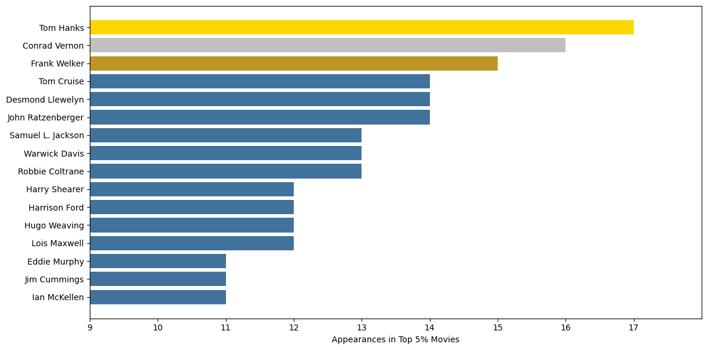
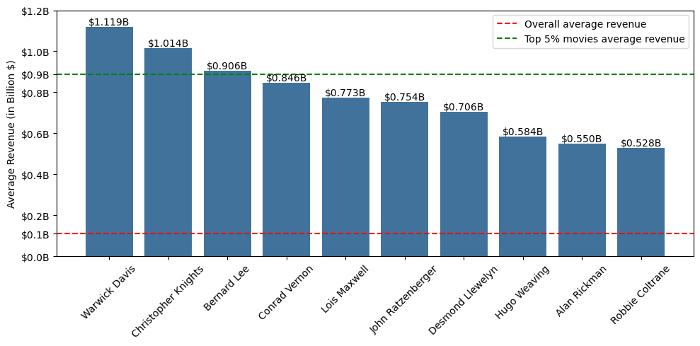

# **What Defines Success for a Movie?**

## **What Does "Success" Mean?**
Defining success in cinema is not a straightforward task—it can mean different things depending on the perspective. For some, success may be tied to **box office revenue**, indicating the financial viability and audience appeal of a movie. For others, it could mean **critical acclaim**, reflected in high ratings and awards. In this study, we analyzed both dimensions of success using the **CMU Movie Dataset** and **IMDb ratings**:

1. **Box Office Revenue**: This metric quantifies financial success. We identified the top 5% of highest-grossing films in our dataset to examine trends among blockbuster movies.

2. **IMDb Ratings**: Representing critical reception, IMDb ratings give us insight into audience satisfaction and acclaim. Ratings were analyzed alongside revenue to uncover possible relationships.

Our findings reveal that financial and critical success do not always go hand in hand. The correlation between box office revenue and IMDb ratings is weak (**~0.082**), showing that a movie can perform well financially without necessarily being highly rated—and vice versa.

### Supporting Statistics
A summary of the dataset’s box office revenue and ratings:

|                 | Movie_box_office_revenue | averageRating |
|-----------------|--------------------------:|--------------:|
| count           |                 1,165.000 |      1,165.000|
| mean            |            1.086598e+07   |       6.354249|
| std             |            2.711448e+07   |       0.898601|
| min             |            1.047400e+04   |       2.400000|
| 25%             |            1.000000e+06   |       5.800000|
| 50%             |            2.600000e+06   |       6.400000|
| 75%             |            9.623329e+06   |       6.900000|
| max             |            2.620622e+08   |       8.500000|

Most movies are rated moderately well (average rating ~6.35) but very few reach extremely high ratings (max rating 8.5). Similarly, while the mean box office revenue is around \$10.9 million, the maximum revenue is about \$262 million, indicating that only a small fraction achieve blockbuster-level earnings.

### Visual Insights
**Scatter Plot of Box Office Revenue vs. IMDb Ratings**  

*Observations*:  
- The red trendline is nearly flat, reaffirming the weak correlation between revenue and rating.  
- While a few high-revenue outliers exist across various rating levels, the majority of films cluster in lower revenue ranges.

**2D Histogram (Heatmap) of IMDb Rating vs. Log of Box Office Revenue**  

*Observations*:  
- The densest areas show that many films are concentrated in moderate rating (around 6) and moderate revenue ranges.  
- Even films with higher ratings do not necessarily show a concentration at the highest revenues, reaffirming the weak linkage.

**Distribution of Box Office Revenue**  

*Observations*:  
- The distribution is heavily skewed to the right, with most movies earning relatively modest amounts and a few blockbusters pulling the mean upward.

**Distribution of IMDb Ratings**  

*Observations*:  
- IMDb ratings approximate a normal distribution centered around 6 to 7. Very few films have extremely low or extremely high ratings.

These plots underscore that financial success (box office) and critical success (ratings) follow different distributions. The majority of movies cluster around the middle for ratings, while revenue has a “long tail” where a few high-earning outliers dominate the financial landscape.

---

# Does the Actor Affect a Movie’s Success?

### Analysis Overview
To investigate whether a character's actor influences a movie's success, we focused on the **top 5% of movies** (approximately 4,000 movies) based on box office revenue. These represent the movies with the highest financial performance. We chose to focus only on the top 5% because this already represents a substantial number of films, and our goal was to specifically analyze the most successful movies.
1. Which actors appeared most frequently in these top-performing movies.
2. The average revenue of movies they played in compared to the overall average revenue of all movies.

### Visualization

#### Top Actors in Successful Movies

#### Average Revenue Comparison
<!-- Below is an interactive plot showing the average revenue of movies for each actor.

<iframe src="static/assets/actor/avg-actor-revenue.html" width="100%" height="600" frameborder="0"></iframe> -->

This bar chart represents the average box office revenue of the movies in which the top 10 actors have appeared.

Each bar corresponds to an actor, and its height shows the average revenue of the movies they participated in (measured in billions of dollars). The red dashed line represents the overall average revenue across all movies in the dataset while the green one takes into account only the top 5% movies.

### Observations
#### Top Actors by Appearances
Interestingly, we also see well-known names like Tom Cruise and Eddie Murphy, though they appear in "only" around 15 of these 4,000 movies. This relatively small number might seem surprising given their fame, and it could be explained by the selection of movies available in our database.

#### Top Actors by Average Revenue
When ranking actors by the average revenue of the movies they appeared in, the top performers are:
- **Warwick Davis** (Average revenue: \$1.12 billion)
- **Christopher Knights** (Average revenue: \$1.01 billion)
- **Bernard Lee** (Average revenue: \$906 million)

Here, we observe that the ranking of actors differs from the first plot, although almost all the actors are the same in both lists. This indicates that while some actors frequently appear in successful movies, their overall revenue contribution might vary.

### Key Insights
We observe that the average revenues of the movies in which the top actors appear are consistently much higher than the overall average revenue of all movies in the dataset. This significant difference highlights that **the presence of these actors likely plays a non-negligible role in the financial success of a movie.**
While other factors such as genre, budget, or storyline may also contribute to a movie's success, the consistent association of these top actors suggests that their involvement adds considerable value to a film's market appeal. This reinforces the idea that casting decisions are a critical factor in determining a movie's performance at the box office.

---

# Does the Genre Influence a Movie's Success?

### Analysis Overview
To investigate whether a movie's genre influences its success, we focused on the top 100 movies from each decade, classified again by box office revenue. By analyzing the trends in genres across decades, we aimed to understand whether certain genres consistently lead to higher financial performance.

### Visualization
The line chart below represents the trends of the top 5 genres by decade based on their frequency among the most successful movies. Each line corresponds to a genre, showing how its popularity changed over time.

### Observations

The most successful genre by far is Action/Adventure. This dominance could be attributed to the fact that these genres are among the most produced and appeal to a wide audience, offering an exciting blend of action and exploration.

Additionally, we notice that **only 9 distinct genres consistently appear in the top lists across decades**. This suggests that these genres are frequently associated with commercially successful movies.

Some genres, such as _Thriller_ and _Romance Film_, exhibit a sharp peak in popularity during certain decades, only to decline in later years. This could reflect changing audience preferences or cultural trends influencing movie production.

The analysis strongly suggests that the genre of a movie has a notable impact on its chances of success, emphasizing the importance of aligning with current trends so as we expected, **YES**, the genre does influence a movie's success!

---

# How Does the Character Archetype Affect a Movie's Success?
Finally, we explored the impact of character archetypes on success metrics, focusing on their presence in high-grossing films.

### Key Archetype Insights
1. **High-Grossing Archetypes**: “Charmer” and “loveable_rogue” characters often lead to higher revenue averages. These archetypes are typically found in broad-appeal action-adventure or family-friendly franchises, resonating well with mass audiences.
   
2. **Action-Adventure Archetypes**: Archetypes like “adventurer_archaeologist”, “gadgeteer_genius”, and “master_swordsman” are associated with big-budget, globally recognized franchises. Such characters often appear in action-adventure or fantasy worlds that typically command large box-office draws.
   
3. **Caution on Sample Size**: Some archetypes might appear in only a handful of films. If one of these films is a blockbuster, it can skew the average upward, so interpretation should consider sample size.

Overall, archetypes aligning with charismatic, adventurous leads frequently correlate with higher revenues, reflecting mainstream audience preferences for engaging, exciting protagonists and familiar narrative tropes.

---

## **Conclusions**
Success in cinema is multifaceted and depends on various factors:

- **Box Office vs. Ratings**: Financial and critical success are not strongly linked. High-revenue movies are not always highly rated. The correlation (~0.082) is minimal, and the scatter and heatmap plots confirm this weak relationship.

- **Actors' Influence**: While some actors (e.g., Warwick Davis, Alan Rickman) are associated with higher box-office revenues, frequency of appearance does not guarantee top earnings. Rather, certain actors tend to be cast in films poised for big successes, boosting their revenue averages.

- **Genre Trends**: Action and Adventure stand out as consistently strong revenue generators across decades, while other genres spike and fade. Popular genres at a given time are more likely to produce financial hits, but not necessarily critical favorites.

- **Character Archetypes**: Archetypes such as “charmer” and “loveable_rogue” often appear in top-grossing franchises. Action-oriented, charismatic leads and side characters tend to resonate widely, aligning with higher box-office revenues.

In essence, financial and critical success emerge from different, sometimes overlapping sets of conditions. While blockbuster status drives big numbers at the box office, a strong critical rating often stems from factors beyond pure financial metrics. Thus, success can be defined differently depending on whether one prioritizes revenue, or cultural impact. 
